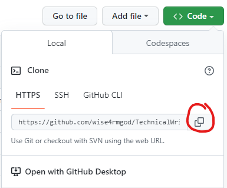

# Introduction To GitHub
## The table of content 
### Introduction
### [What is GitHub](#github-id)
### [Why GitHub](#why-github-id)
### [Git vs. GitHub](#git-vs-github)
### [How to Clone a Github Repository](#clone)
### [How to Fork a Github Repository](#fork)
### [How to Make Commit](#commit)
### [How to Make a Pull Request on Github](#pull)
### [GitHub Desktop vs. Github CLI](#github-vs-cli)
### [Conclusion](#conclusion)

The beauty of open source is the opportunity it provides to tech euthiasist all over the world. The possibility of having people from different parts of the world contribute to a particular project in real time is really incredible.
And one tool that makes these contributions and collaborations possible is Github. In this article we will be going through some basic things you need to know about Github so that you can start contributing to projects today.

## What is Github {name=github-id}
Github is a hosting platform that allows you to store, version, or track changes and also collaborate with other individuals on software projects. 

You may be asking what all this means. Let me explain. Imagine I started a project on my local machine, but I want a place where I can save this project online so that I can easily retrieve it in case anything happens to my local machine (store). That's one advantage of Github. 

Let's also imagine that I want to also make changes to that project, and after making those changes, I will also want to send it to Github to store and update the project with the latest changes. That's another advantage of Github.

Github is also able to track changes made to that project. This is important because you can easily revert to any point where a change was made in case there was an error with a recent change.

Finally, Github also allows you to collaborate on projects. After storing my code on Github, if I make the project repository public, anybody from anywhere in the world can also make contributions to that project.

## [Why Github?](#why-github-id)
I think this question is relative. The reason is that each person you ask might have a different platform they prefer. However, Github seems to be more popular amongst the developer community. And, I was introduced to Github first, and over time I have discovered that it's easier to use and easier for collaboration and making contributions.

## [What is the difference between Git and Github](#git-vs-github)
This is one question lots of newbies ask, and maybe because oftentimes they have heard people mention Git and Github in the same sentence, but they couldn't be more different. 

Git is a version control system that answers questions like when was a change made, who made that change, what folder or file was the change made in, and why was the change made. 

While Github is a platform that uses the power of Git to help you manage Git repositories, that is why you can track changes made to a repository in Github.

## [How to Clone a Github Repository](#clone)
Cloning, just like the name suggest is creating a copy of a remote repository in your local machine, with the repository was created by you or not, you can clone it. And how do you do this? you can either use the Github Desktop or the command line. I will work you through how to do both.

**Cloning with Github Desktop**
You will need to have the Github Desktop application installed in your local machine. If you have that installed, here are the steps to take:
- Open the Github Desktop application
- Click on file, a drop down will appear
- Click on Clone repository

- A modal will pop up, where you can choose to use Github.com, Github Enterprise, or URL.
You will see a list of all the repositories you have created or forked. You can choose any of the repositories and click on clone.

Under Github Enterprise, you will need to have a [Github Enterprise](https://github.com/enterprise) account to use it.

Under URL, you will need to copy the URL of the Github repository you want to clone and paste it on the empty field, After that, click on clone.

**Cloning with the command line**
Before you can clone the repository on your local machine, you will first need to get the URL of the repository in question.  You can do that by following these steps:

- Go to the repository you want to clone on Github
- Click on the **Code** button, and a drop down menu will appear
- Copy the URL of the repository

- Open your command line and `cd` into any folder of you choice
- Use the command below
`git clone [Paste the URL of the repository here]`
- Click enter

## [How To Fork a Github Repository](#fork)
When you want to contribute to a project that isn't yours, before cloning, the first thing you need to do is to fork that repository. By forking that repository, you are creating a personal copy of that repository on your Github. After forking, you will notice that the repository will be added to your list of repositories on GitHub.

**Why do I need to fork a repository?**
If you go ahead and clone a repository you don't have access to without first forking it, you won't be able to make contributions to that repository because it is not yours. But when you fork the repository first, you have a copy you can make changes to, and after making your desired change, you can push (store) that change(s) to GitHub and then make a pull request to the original repository.

**To fork a repository, follow these steps:**
- Go to that repository on Github and click on fork 

- You will see a new screen like the one below 

- Click on **create fork**. (You can also change the name of the repository if you want to)
If the forking is successful, you will notice you now have a repository by that name. You will also see that it will point you to the original repository it was forked from. 

## [How to Make a Commit](#commit)
As you work on your projects or contribute to other projects, for each bug you fix or addition you make, you should write a commit message, describing in simple, short, and clear terms what changes you made.This commit message helps you know when and what change you made at a particular time, and if its a project you are contributing to, it helps the maintainer of that project know what changes you made even before looking at the code.
So how do you make commits on Github? Before making a commit, you should first stage the changes you have made. 
either by using:

`git add [name of file]` To stage a particular file

or

`git add .` To Stage all the changes you made.

After staging your changes, you can then proceed to commiting your changes by running the command below

`git commit -m "[commit message]"`

an example is

`git commit -m "Added dashboard pagination"`

## [How to make a Pull Request](#pull)
After forking a repository and making your contribution to a project, you need a way to be able to tell the owner or maintainer of that project that you have made a contribution and that you will want them to merge it into the main project repository. A pull request is the way to do that.

What happens when you fork a repository on Github? Github watches your forked repository and the repository you forked from for any changes in both repositories. Github is able to tell when changes have been made to the original repository you forked from. 
It's important that you ensure that your branch is in sync with the original branch before raising a pull request. If you don't, it will create [merge conflicts](https://docs.github.com/en/pull-requests/collaborating-with-pull-requests/addressing-merge-conflicts/about-merge-conflicts).

How do you know if new changes have been made to the original repository you forked from? It is simple, just go to your own forked repository and click on the ``Sync fork`` option. If there has been new commits made to the original repository, you should see this

You can then click on ``Update Branch`` to update your branch, you can also click on ``Compare`` to see the commits that has been added.

If there has not been any changes, meaning your forked repositiry is up to date, you will see this

 

After you have updated your branch, you can now create a pull request without [merge conflicts](https://docs.github.com/en/pull-requests/collaborating-with-pull-requests/addressing-merge-conflicts/about-merge-conflicts).
When you have pushed your changes to Github, click on the `contribute` option.

Then click on the `Open pull request` button to create a pull request.

## [GitHub Desktop vs Github CLI](#github-vs-cli)
[Github Desktop](https://desktop.github.com/) is a graphical user interface that helps you interact with Github without using the browser. From the Github Desktop, you can perform actions such as creating a repository, cloning a repository, making a pull request, and committing just with a few clicks.

[Github CLI](https://cli.github.com/) is a command-line tool that helps you access various Github features without having to leave your terminal. you can make a pull request, open an [issue](https://docs.github.com/en/issues/tracking-your-work-with-issues/about-issues), and so on. You can see the list of Github CLI commands [here](https://cli.github.com/manual/gh).

## [Conclusion](#conclusion)
Knowing how Git and GitHub work is important for a developer or technical writer who is looking to collaborate with others and work on amazing projects. It is also an important criterion if you want to be employable.
In this article, we have been able to cover some aspects of Github, like how to make a pull request, how to fork a repository, and how to clone a repository. We even touched on the difference between Git and GitHub and the difference between GitHub desktop and Github CLI. But that is not all. There is still more to learn, and for that reason, I will be suggesting relevant resources you can use to learn more about Git and Github.

## Other Relevant Resources
- [Github Docs](https://docs.github.com/en/get-started/quickstart)
- [Git and GitHub for Beginners - Crash Course](https://www.youtube.com/watch?v=RGOj5yH7evk&t=160s)
- [Git and GitHub Tutorial – Version Control for Beginners](https://www.freecodecamp.org/news/git-and-github-for-beginners/)
- [Github Guide](https://github.com/git-guides/git-commit)